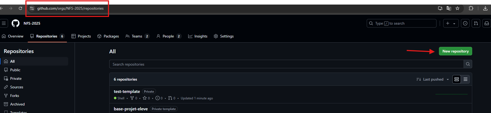
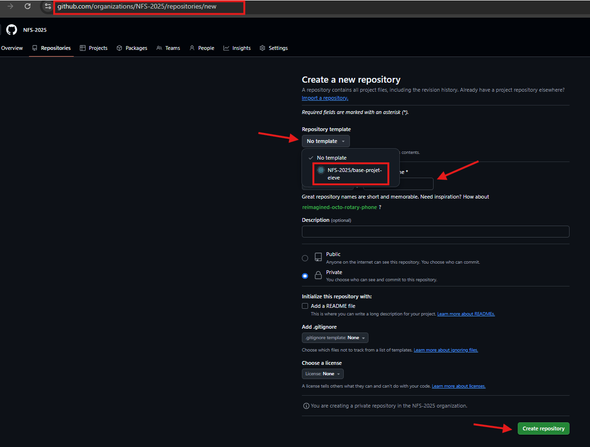

# Liens des diapos en consultation :

- 1 - Intro : https://gamma.app/docs/React-1-Introduction-zupgwngagdzm9ws
- 2 - Bases : https://gamma.app/docs/React-2-Bases-Tic-Tac-Toe-vrp280zksucn3w5
- 3 - Cycle de vie : https://gamma.app/docs/React-3-Cycle-de-vie-TCG-Pokemon-h9x9z6cb8nmldfu
- 4 - Formulaires : https://gamma.app/docs/React-4-Formulaires-vtvumdmf5w9p4sv
- 5 - Aller plus loin : https://gamma.app/docs/React-5-Aller-plus-loin-gzisoj7ikhaatie

# Création d'un nouveau projet

Ce projet fait office de "template" github. Il faut l'utiliser lors de la création d'un nouveau projet en suivant les étapes ci-dessous

- Etape 1 : Créer un nouveau repo

- Etape 2 : Indiquer le template et le nom du nouveau repo

# Pré-requis

- Installer node (la version 22 est la TLS)
- Installer npm

# Installation

- create-react-app est deprecated (https://create-react-app.dev/docs/adding-typescript/)
- Doc de création d'app : https://react.dev/blog/2025/02/14/sunsetting-create-react-app
- Doc spécifique pour vite : https://vite.dev/guide/

## Avec vite

- React.js : `npm create vite@latest <nom-app> -- --template react`
- React.ts : `npm create vite@latest <nom-app> -- --template react-ts`

### Remarques

- Si l'IDE affiche des erreurs par rapport à react/jsx-runtime lorsqu'on ouvre un fichier tsx, penser à bien faire "npm install" pour que les node modules du nouveau projet s'installe
